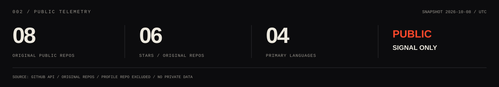
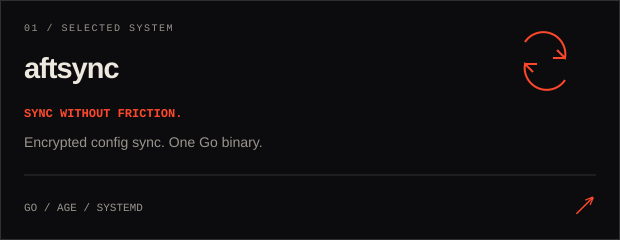
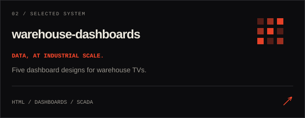
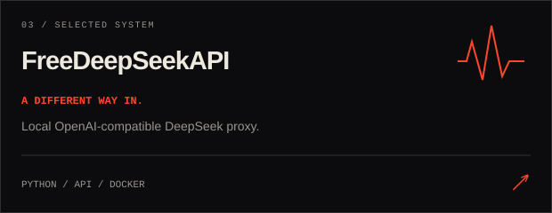
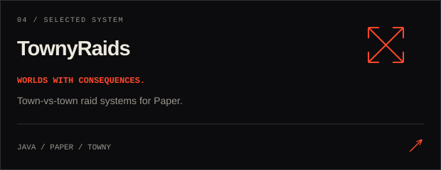
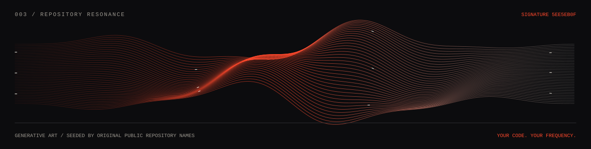
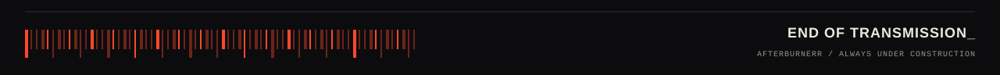

  

  <a href="https://github.com/afterburnerr?tab=repositories">EXPLORE THE SYSTEMS</a> &nbsp; / &nbsp;
  <a href="https://github.com/afterburnerr/afterburnerr/blob/main/docs/INSPIRATION.md">ENTER THE REFERENCE ARCHIVE</a>

Строю инструменты для AI, автоматизации и игровых серверов. Люблю, когда сложные системы получают неожиданный интерфейс.

<table>
<tr>
<td width="50%"></td>
<td width="50%"></td>
</tr>
<tr>
<td width="50%"></td>
<td width="50%"></td>
</tr>
</table>

<strong>OPEN THE AUXILIARY BAY</strong> — ещё системы и эксперименты

 

| Система | Что внутри |
| :--- | :--- |
| [KworkTelegramBot](https://github.com/afterburnerr/KworkTelegramBot) | Мониторинг проектов Kwork и фильтрация через DeepSeek. |
| [TownyHomes](https://github.com/afterburnerr/TownyHomes) | Общие точки дома для городов Towny, локализация и SQLite/MySQL. |
| [opencode-auto-model](https://github.com/afterburnerr/opencode-auto-model) | Форк открытого coding agent — лаборатория экспериментов. |

<strong>REACTOR BLUEPRINT</strong> — как устроен этот профиль

 

Авторская SVG-графика: вращающиеся кольца, пульсирующее ядро, сканирующий луч. Анимация учитывает настройку reduced motion. Карточки ведут прямо в репозитории, телеметрия обновляется каждый день через GitHub Actions. Все изображения хранятся здесь; сторонние сервисы карточек не нужны.

[Референсы и необычные профили](docs/INSPIRATION.md) · [Сборка графики](scripts/build.py) · [Автообновление](.github/workflows/telemetry.yml)

 

