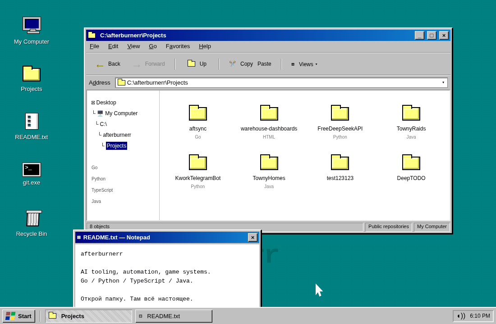

<picture>
  <source media="(prefers-reduced-motion: reduce)" srcset="prototypes/c/desktop.png" />
  
</picture>

[aftsync](https://github.com/afterburnerr/aftsync) · [warehouse-dashboards](https://github.com/afterburnerr/warehouse-dashboards) · [FreeDeepSeekAPI](https://github.com/afterburnerr/FreeDeepSeekAPI) · [TownyRaids](https://github.com/afterburnerr/TownyRaids)

[KworkTelegramBot](https://github.com/afterburnerr/KworkTelegramBot) · [TownyHomes](https://github.com/afterburnerr/TownyHomes) · [Все репозитории](https://github.com/afterburnerr?tab=repositories)
