# afterburnerr / два эксперимента

Два прототипа оформления. Это отдельная ветка: основной профиль не заменён.

## A. Здесь кто-то живёт

Существо обитает внутри README: берёт `aftsync`, жуёт и выплёвывает баг. Двенадцатисекундная сценка, нарисованная и анимированная с нуля. В браузерном прототипе можно покормить, постучать по стеклу и дать поспать.

[Анимированное GIF-превью](prototypes/a/preview.gif) · [Исходники и описание](prototypes/a/README.md)

## B. Ночная смена

Маленький ночной уборщик, мастерская и четыре окна с проектами, которые никак не встают на место. Десятисекундный цикл. В браузерном прототипе можно остановить и возобновить смену.

[Анимированное GIF-превью](prototypes/b/preview.gif) · [Исходники и описание](prototypes/b/README.md)

---

SVG-анимации работают непосредственно как изображения в GitHub README. Кнопки сейчас реализованы в `index.html` для просмотра в браузере. Внутри GitHub JavaScript не исполняется: следующий этап интерактивности — общие действия посетителей через Issues → Actions, если выбираем такой путь.

Локальный просмотр: `python3 -m http.server 18765`, затем открыть `http://localhost:18765/prototypes/`.
